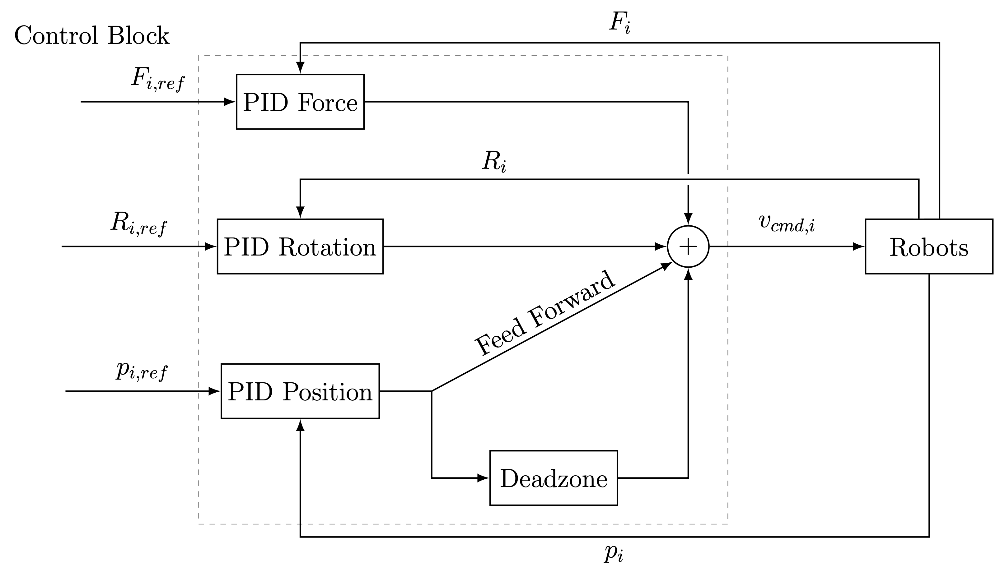
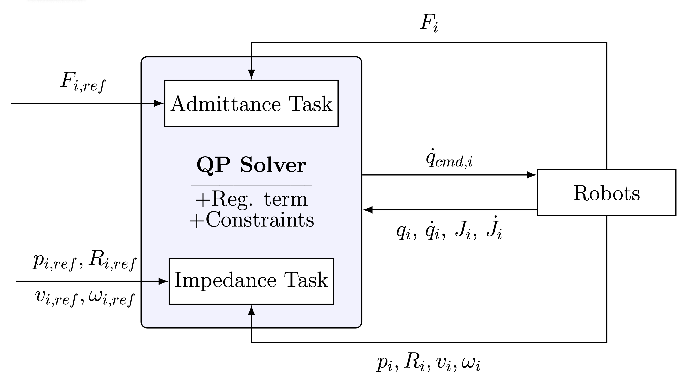

# Dual arm manipulation

This repository implements a cooperative dual-arm manipulation approach for side-grasping box-shaped objects using UR5e robots, emphasizing real-time control over complex motion planning. It features two experimentally validated strategies: a multi-stage PID controller for robust force regulation and a QP-based impedance-admittance controller for compliant, stable interaction.

## Demos

<table width="100%">
  <tr>
    <td width="50%">
      <h3 align="center">8figure path (PID)</h3>
      <div align="center">
        
      </div>
    </td>
    <td width="50%">
      <h3 align="center">Circular path (QP)</h3>
      <div align="center">
        
      </div>
    </td>
  </tr>

  <tr>
    <td width="50%">
      <h3 align="center">10kg transportation (QP)</h3>
      <div align="center">
        
      </div>
    </td>
    <td width="50%">
      <h3 align="center">Fast pick-and-place (PID)</h3>
      <div align="center">
        
      </div>
    </td>
  </tr>

  <tr>
    <td width="50%">
      <h3 align="center">Twist movement (PID)</h3>
      <div align="center">
        
      </div>
    </td>
    <td width="50%">
      <h3 align="center">Linear movement (QP)</h3>
      <div align="center">
        
      </div>
    </td>
  </tr>
</table>

## Methodology
<table>
  <tr>
    <td align="center">
      
      <br />
      <em>Figure 1: PID based force and pose controller with added deadzone and feed forward term.</em>
    </td>
    <td align="center">
      
      <br />
      <em>Figure 2: Quadratic Programming based impedance-admitance controller.</em>
    </td>
  </tr>
</table>

## Installation
Clone the repo:
```bash
git clone git@github.com:adamweinhardt/dual-arm-manipulation.git
cd dual-arm-manipulation/
```
And simply install with a venv:
```bash
pip install -e .
```

## Start Guide:
1. Plug in your calibration and pose estimation pipeline.
2. Run the grasping points calculation:
   ```python
   python3 -m grasping_points.grasping_points
   ```
3. Then run one of the controllers with the necessary reference trajectory:
   ```python
   python3 -m control.PID.pid_ff_controller #or
   python3 -m control.QP.qp_full
   ```


